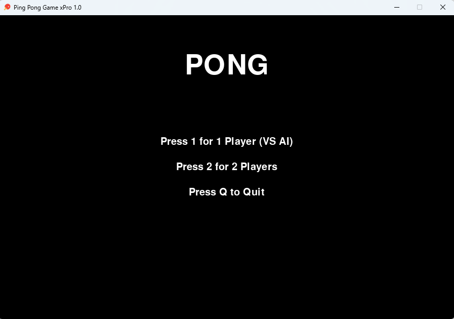
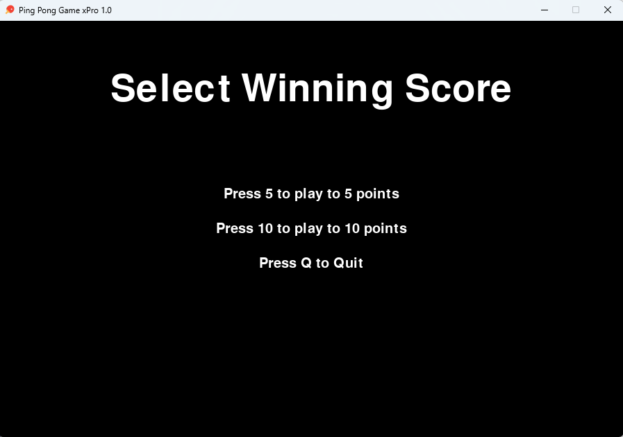
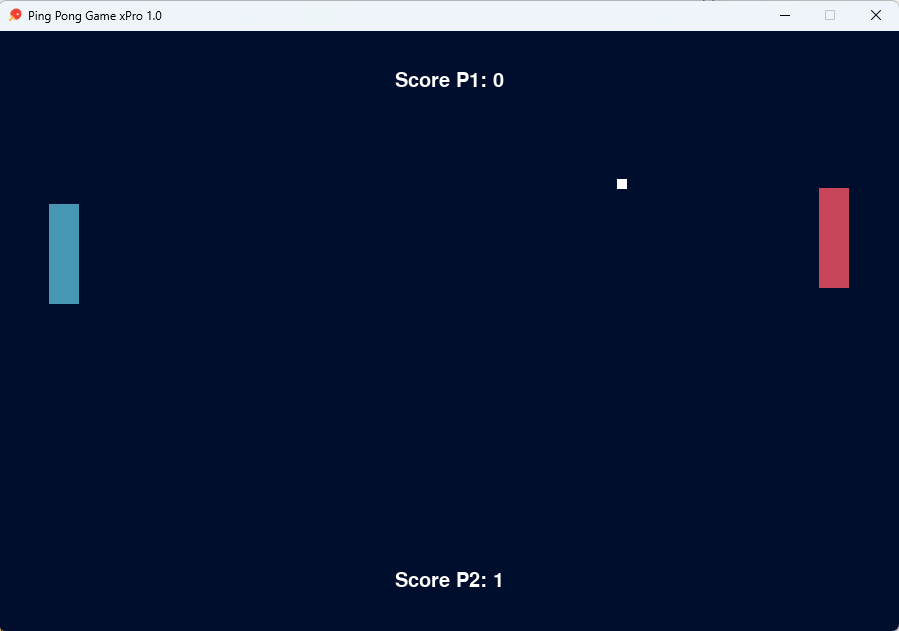
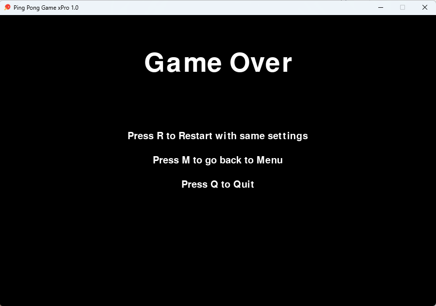

# 🏓 **Pong Game with AI - Python & Pygame**

---

## 📜 **Project Description**
This is a classic **Pong game** implemented in Python using the **Pygame** library. The project includes two game modes:

🎮 **Two-Player Mode:** Two players compete against each other, each controlling a paddle.

🤖 **Single-Player Mode:** One player competes against an **AI** that controls the second paddle.

The game features an **interactive menu** to select the game mode and the number of points required to win. It also includes **sound effects, a scoring system, and an intuitive graphical interface**.

---

## ✨ **Main Features**
✔️ **Interactive Menu:** Choose between playing against AI or two-player mode.

✔️ **Point Selection:** Play up to **5 or 10 points**.

✔️ **Artificial Intelligence:** The AI efficiently follows the ball, providing a realistic challenge.

✔️ **Sound Effects:** Custom sounds for hits, bounces, and scores.

✔️ **Graphical Interface:** Clean, responsive design with custom colors and centered text.

✔️ **Restart & Exit Options:** Restart the game, return to the main menu, or exit anytime.

---

## 🛠️ **Technologies Used**
🚀 **Python:** Main programming language.

🎮 **Pygame:** Library for game development in Python.

🔍 **Object-Oriented Programming (OOP):** Modular and reusable functions.

🧠 **AI Logic:** Simple algorithm for AI-controlled paddle movement.

🎛️ **Event Handling:** Keyboard events for paddle control and menu navigation.

---

## 🏆 **Skills Demonstrated**
### 🎮 **Game Development**
- Developed a **functional and engaging** game from scratch.
- Used **Pygame** to render graphics, manage events, and play sounds.

### 🎨 **UI/UX Design**
- Implemented **interactive menus** with centered text and customizable options.
- Applied **custom colors and fonts** to enhance the user experience.

### 🧠 **Programming Logic**
- Developed **AI** to autonomously control the paddle.
- Implemented **collision detection and basic physics** for ball movement.

### 🎮 **Event & Input Handling**
- Used **keyboard events** for paddle control and menu navigation.
- Managed **collisions** between the ball, paddles, and screen borders.

### 🏗️ **Code Organization**
- Modular and **well-structured** code with reusable functions.
- Used **constants** for easy configuration and maintenance.

---

## 🚀 **Installation & Execution**
### 📌 **Requirements:**
Ensure you have **Python 3.x** installed.
Install the Pygame library using:
```bash
pip install pygame
```

### ▶️ **Run the Game:**
1️⃣ Clone this repository or download the `pong.py` file.
2️⃣ Navigate to the project directory and run:
```bash
python pong.py
```

---

## 📸 **Screenshots**
🖥️ **Main Menu**
&nbsp; 
🎮 **Two-Player Mode or** 🤖 **Single-Player Mode (VS AI)**

🔄 **Restart Menu**


---

## 🎮 **How to Play**
### 🏠 **Main Menu:**
🔹 Press **1** to play against the AI.  
🔹 Press **2** to play in two-player mode.  
🔹 Press **Q** to exit.

### 🎯 **Point Selection:**
🔹 Press **5** to play up to **5 points**.  
🔹 Press **10** to play up to **10 points**.  
🔹 Press **Q** to exit.

### 🎮 **Controls:**
🔹 **Player 1:** Use **W** (up) and **S** (down).  
🔹 **Player 2 (Two-Player Mode):** Use **↑** (up) and **↓** (down).  

### 🔄 **Restart Options:**
🔹 Press **R** to restart with the same settings.  
🔹 Press **M** to return to the main menu.  
🔹 Press **Q** to exit.

---

## 🤝 **Contributions**
💡 **Contributions are welcome!** If you want to improve the game, follow these steps:
1️⃣ **Fork** the repository.  
2️⃣ Create a new branch:
```bash
git checkout -b new-feature
```
3️⃣ Make your changes and commit them:
```bash
git commit -m 'Add new feature'
```
4️⃣ Push to the branch:
```bash
git push origin new-feature
```
5️⃣ Open a **Pull Request**.

---

## 👤 **Author**
📌 **Name:** David Serrano Franco  
💻 **GitHub:** github.com/DavidSerranoFranco 
🔗 **LinkedIn:** linkedin.com/in/david-serrano-franco-77805025b/  

---

## 📜 **License**
This project is licensed under the **MIT License**. See the `LICENSE` file for more details.


